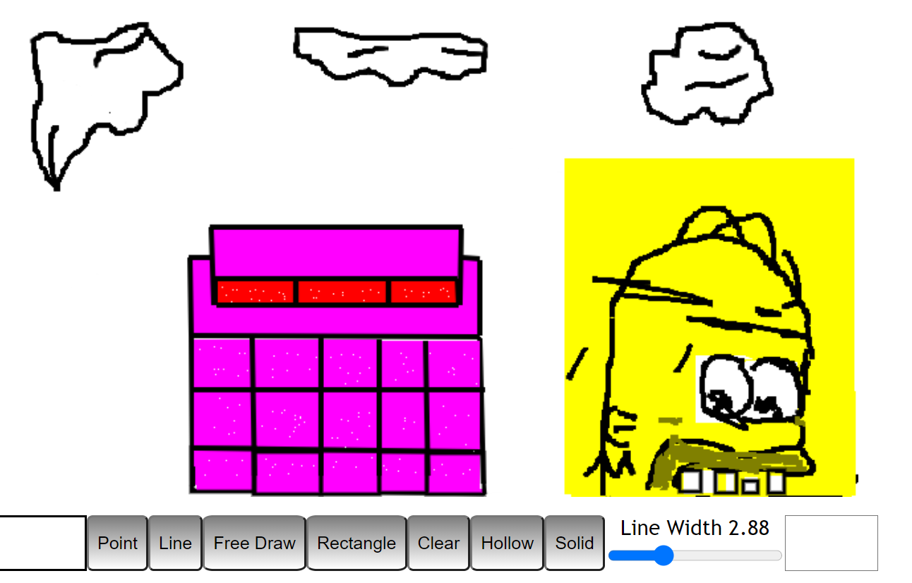
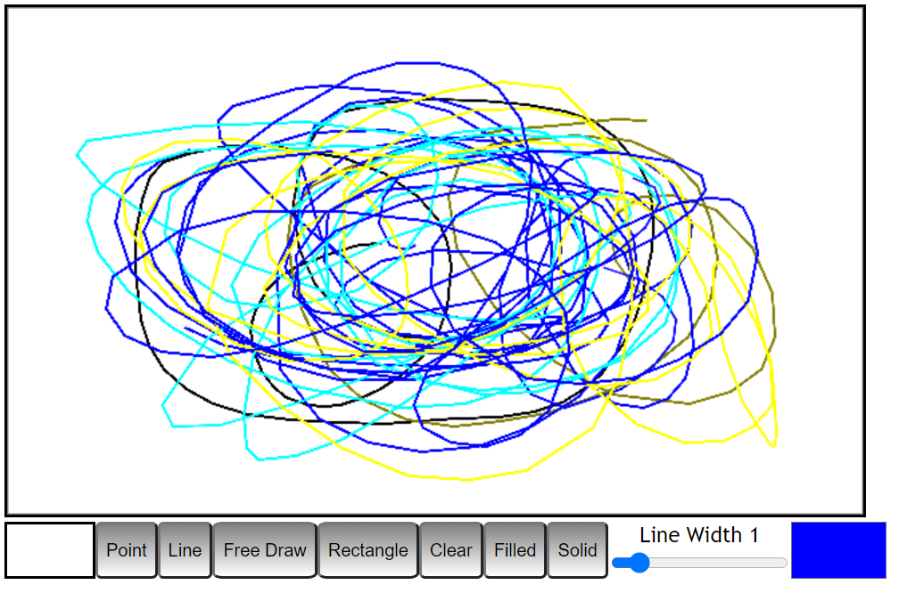

This app is designed to mimic the look and feel of early Windows 1.x paint programs. An innovation on Macpaint, these programs were the first to explore 640 X 380 EGA bitmap creation, featuring a generous 16 color palette.

View the live version <a href="https://princeofshapeir.github.io/scheisspaint">here.</a>

You can view the developer homepage <a href="https://princeofshapeir.github.io/react-portfolio/">here</a>.

Here are some examples of "art" created with the tool:

